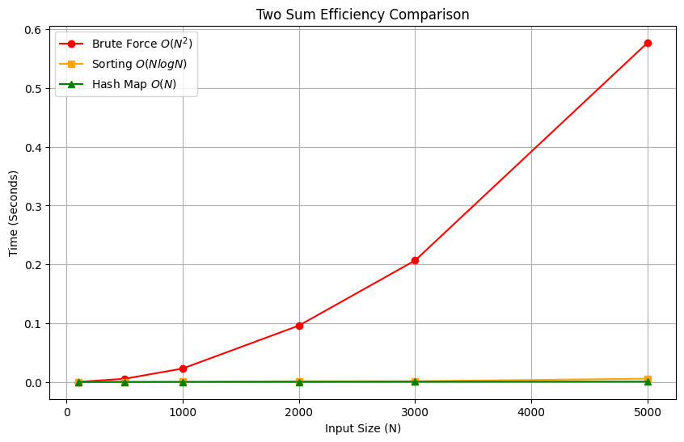

# 0001. Two Sum

| **Author** | **Last Updated** | **Difficulty** | **Tags** |
| :--- | :--- | :--- | :--- |
| MD Saifullah Baig.A | 01.01.2026 | 🟢 Easy | Array, Hash Table |

**Problem Link:** [LeetCode 0001](https://leetcode.com/problems/two-sum/)

---

## 📂 Quick Access
| Approach | Time Complexity | Space Complexity | Code Link |
| :--- | :--- | :--- | :--- |
| **1. Brute Force** | $O(N^2)$ | $O(1)$ | [📄 View Solution](./Brute_Force/Brute_Force.py) |
| **2. Sorting** | $O(N \log N)$ | $O(N)$ | [📄 View Solution](./Sorting/Sorting.py) |
| **3. Hash Map** | $O(N)$ | $O(N)$ | [📄 View Solution](./One_Pass_Hash_Map(Best)/One_Pass_Hashmap.py) |

---

## 1. Problem Statement

Given an array of integers `nums` and an integer `target`, return indices of the two numbers such that they add up to `target`.

* You may assume that each input would have **exactly one solution**.
* You may not use the same element twice.

**Example 1:**
```text
Input: nums = [2,7,11,15], target = 9
Output: [0,1]
Explanation: Because nums[0] + nums[1] == 9, we return [0, 1]
```
## 2. Approach Analysis
#### 🐢 Approach 1: Brute Force (Naive)
The most intuitive method. We simply check every possible pair in the array to see if they sum to the target.
* Logic:
    1. Loop through nums with pointer i.
    2. Loop through the remaining elements with pointer j (starting from i+1)
    3. Check if nums[i] + nums[j] == target.
* Complexity:
    + Time: $O(N^2)$ — Nested loops cause quadratic growth.
    + Space: $O(1)$ — No extra memory is used.
+ Verdict: Too slow for large inputs ($N > 10,000$).
---
#### ⚖️ Approach 2: Sorting + Two Pointers
A classic technique that works efficiently on sorted arrays.
* Logic:
    1. Preserve Indices: Since sorting changes positions, we first store pairs of (value, original_index).
    2. Sort: We sort these pairs based on the values.
    3. Two Pointers: Place one pointer at the start (left) and one at the end (right).
    4. Search:
        * If sum < target: Move left forward to increase the sum.
        * If sum > target: Move right backward to decrease the sum.
* Complexity:
        *Time: $O(N \log N)$ — Dominated by the sorting step.
        *Space: $O(N)$ — Required to store the index pairs.
* Verdict: Good, but sorting adds overhead compared to the Hash Map.
---
#### 🚀 Approach 3: One-Pass Hash Map (Optimal)
The industry standard solution. We trade a little memory for maximum speed.
* Logic:
    1. Initialize an empty dictionary (Hash Map).
    2. Iterate through the array once.
    3. For every number n, calculate its complement: diff = target - n.
    4. Check: Is diff already in the map?
        * Yes: We found the pair! Return their indices.
        * No: Store n in the map and continue.
* Complexity:
    1. Time: $O(N)$ — We touch every element exactly once.
    2. Space: $O(N)$ — The map stores up to $N$ elements.
* Verdict: Optimal. This is the expected solution in interviews.
---
## 3. 📊 Efficiency Graph
```text
The graph below visually demonstrates the efficiency gap. Notice how the Hash Map (Green) remains flat while Brute Force (Red) spikes vertically.
```


## 4. LeetCode Submission Results

<br>
# 📂 Project Structure

```text
DSA/
├── Array and Hashmaps/
│   └── Hashing/
|           |0001_Two_Sum/
│           ├── assets/
│           │   ├── efficiency_graph.png       # Visualization of Time Complexity
│           │   └── Submission_Results.png     # Acceptance Rank
│           │
│           ├── Brute_Force/
│           │   └── Brute_Force.py             # Beginner Approach (O(N^2))
│           │   └── Brute_Force.ipynb          # Reference Jupyter Notebook
│           │
│           ├── Sorting/
│           │   └── Sorting.py                 # Two-Pointer Approach (O(N log N))
│           │   └── Sorting.ipynb              # Reference Jupyter Notebook
│           │
│           ├── One_Pass_Hash_Map(Best)/
│           │   └── One_Pass_Hashmap.py        # Optimal Approach (O(N))
│           │   └── One_Pass_Hashmap.ipynb     # Reference Jupyter Notebook
│           │
│           └── README.md                      # Problem Documentation & Analysis
```