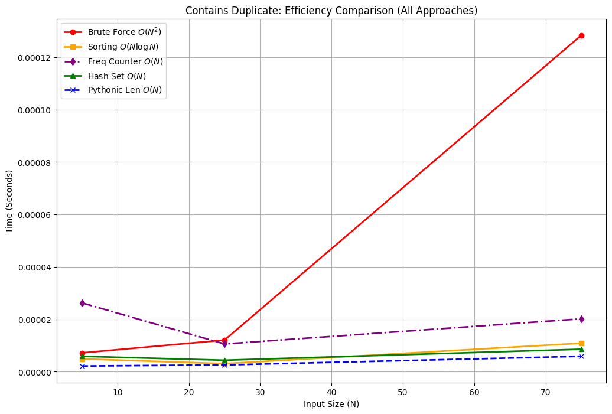
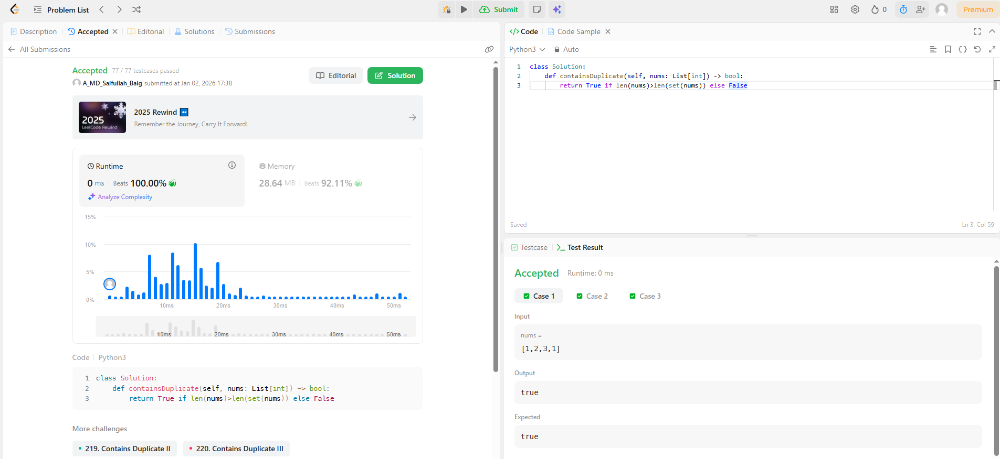

# 0217. Contains Duplicate

| **Author** | **Last Updated** | **Difficulty** | **Tags** |
| :--- | :--- | :--- | :--- |
| MD Saifullah Baig.A | 01.01.2026 | 🟢 Easy | Array, Hash Table, Sorting |

**Problem Link:** [LeetCode 0217](https://leetcode.com/problems/contains-duplicate/)

---

## 📂 Quick Access
| Approach | Time Complexity | Space Complexity | Code Link |
| :--- | :--- | :--- | :--- |
| **1. Brute Force** | $O(N^2)$ | $O(1)$ | [📄 View Solution](./Brute_Force/Brute_Force.py) |
| **2. Sorting** | $O(N \log N)$ | $O(1)$ | [📄 View Solution](./Sorting/Sorting.py) |
| **3. Hash Set** | $O(N)$ | $O(N)$ | [📄 View Solution](./Hashing(Best)/Hashing.py) |
| **4. Length Comparison**| $O(N)$ | $O(N)$ | [📄 View Solution](./Hash_Length_Comparision/Hash_Length_Comparision.py) |
| **5. Freq Counter** | $O(N)$ | $O(N)$ | [📄 View Solution](./Frequency_Counter/Frequency_Counter.py) |

---

## 1. Problem Statement

Given an integer array `nums`, return `true` if any value appears **at least twice** in the array, and return `false` if every element is distinct.

**Example 1:**
```text
Input: nums = [1,2,3,1]
Output: true
```

## 2. Approach Analysis

#### 🐢 Approach 1: Brute Force (Naive)
The most intuitive method. We simply check every element against every other element to find a duplicate.
* **Logic:**
    1. Loop through `nums` with pointer `i` from index `0` to `N-1`.
    2. Loop through the remaining elements with pointer `j` from `i+1` to `N-1`.
    3. Check if `nums[i] == nums[j]`. If true, return `True`.
    4. If loops finish without matches, return `False`.
* **Complexity:**
    * **Time:** $O(N^2)$ — Nested loops cause quadratic growth ($N \times N$).
    * **Space:** $O(1)$ — No extra memory is used.
* **Verdict:** ❌ **Time Limit Exceeded (TLE)**. Too slow for large inputs ($N > 10,000$).

---

#### ⚖️ Approach 2: Sorting
If the array is sorted, any duplicate elements will be positioned **adjacent** to each other (e.g., `[1, 1, 2, 3]`).
* **Logic:**
    1. **Sort**: Sort the array in ascending order `nums.sort()`.
    2. **Iterate**: Traverse the sorted array from index `0` to `N-2`.
    3. **Check**: If `nums[i] == nums[i+1]`, return `True`.
* **Complexity:**
    * **Time:** $O(N \log N)$ — Dominated by the sorting algorithm (e.g., Timsort).
    * **Space:** $O(1)$ to $O(N)$ — Depends on whether the sort is in-place or uses auxiliary stack space.
* **Verdict:** ⚠️ **Acceptable**, but slower than linear time approaches. Useful if space is extremely constrained.

---

#### 🚀 Approach 3: Hash Set (Optimal)
The industry standard solution. We use a **Hash Set** to keep track of elements we have already seen as we iterate.
* **Logic:**
    1. Initialize an empty set `seen`.
    2. Iterate through each number `n` in `nums`.
    3. **Check**: Is `n` already in `seen`?
        * **Yes:** Duplicate found! Return `True`.
        * **No:** Add `n` to `seen` and continue.
* **Complexity:**
    * **Time:** $O(N)$ — We iterate once. Set lookups/insertions are $O(1)$ on average.
    * **Space:** $O(N)$ — In the worst case (all distinct), the set stores $N$ elements.
* **Verdict:** ✅ **Optimal**. This is the fastest and most expected solution in interviews.

---

#### 🐍 Approach 4: Pythonic Length Comparison
A concise one-liner exploiting the property that **Sets cannot contain duplicates**.
* **Logic:**
    1. Convert the list `nums` to a set: `unique_elements = set(nums)`.
    2. Compare the length of the list vs. the set.
    3. If `len(nums) > len(unique_elements)`, it means items were removed (duplicates existed) -> Return `True`.
* **Complexity:**
    * **Time:** $O(N)$ — Creating a set requires iterating over all elements.
    * **Space:** $O(N)$ — To store the unique elements in the set.
* **Verdict:** ✅ **Optimal & Concise**. Functionally identical to Approach 3 but written in "Pythonic" style.

---

#### 📊 Approach 5: Frequency Counter
We count the occurrences of every element using a hash map (or Python's `collections.Counter`).
* **Logic:**
    1. Construct a frequency map of all elements: `counts = Counter(nums)`.
    2. Iterate through the values (counts) in the map.
    3. If any count is greater than 1, return `True`.
* **Complexity:**
    * **Time:** $O(N)$ — We traverse the array to build the count map.
    * **Space:** $O(N)$ — To store counts for unique elements.
* **Verdict:** ✅ **Valid**, but slightly less efficient than Approach 3 because it often processes the entire array to build the map, whereas Approach 3 can return `True` immediately upon finding the first duplicate.

## 3. 📊 Efficiency Graph
```text
The graph below visually demonstrates the efficiency gap. Notice how the Hash Map (Green) remains flat while Brute Force (Red) spikes vertically.
```


## 4. LeetCode Submission Results

<br>
# 📂 Project Structure

```text
DSA/
├── Array and Hashmaps/
│   └── Hashing/
|           |0001_Two_Sum/
│           ├── assets/
│           │   ├── efficiency_graph.png                        # Visualization of Time Complexity
│           │   └── Submission_Results.png                      # Acceptance Rank
│           │
│           ├── Brute_Force/
│           │   └── Brute_Force.py                              # Beginner Approach (O(N^2))
│           │   └── Brute_Force.ipynb                           # Reference Jupyter Notebook
│           │
│           ├── Sorting/
│           │   └── Sorting.py                                  # Two-Pointer Approach (O(N log N))
│           │   └── Sorting.ipynb                               # Reference Jupyter Notebook
│           │
│           ├── Hashing(Best)/
│           │   └── Hashing.py                                  # Optimal Approach (O(N))
│           │   └── Hashing.ipynb                               # Reference Jupyter Notebook
│           │
│           ├── Hash_Length_Comparision(Pythonic_Best)/
│           │   └── Hash_Length_Comparision.py                  # Optimal Approach (O(N))
│           │   └── Hash_Length_Comparision.ipynb               # Reference Jupyter Notebook
│           │
│           ├── Frequency_Counter/
│           │   └── Frequency_Counter.py                        # Optimal Approach (O(N))
│           │   └── Frequency_Counter.ipynb                     # Reference Jupyter Notebook
│           │
│           └── README.md                                       # Problem Documentation & Analysis
```