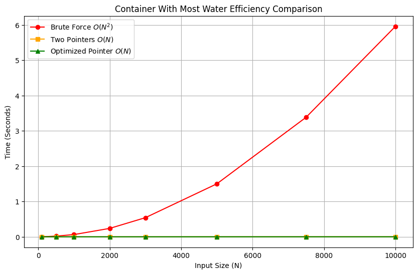
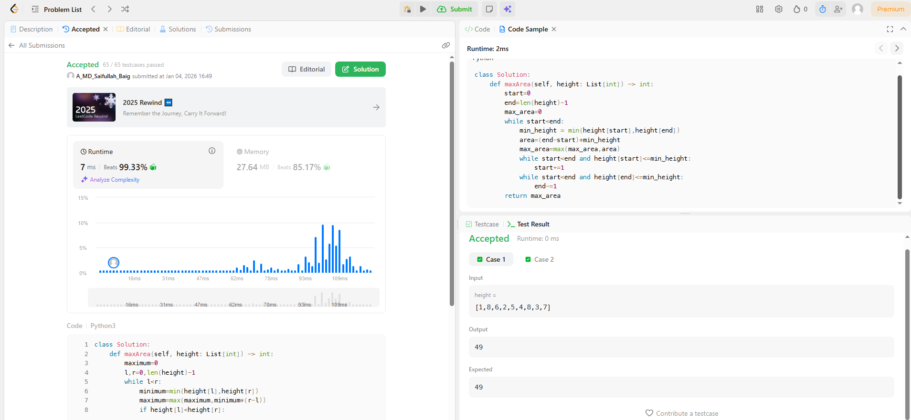

# 0011. Container With Most Water

| **Author** | **Last Updated** | **Difficulty** | **Tags** |
| :--- | :--- | :--- | :--- |
| MD Saifullah Baig.A | 04.01.2026 | 🟡 Medium | Array, Two Pointers, Greedy |

**Problem Link:** [LeetCode 0011](https://leetcode.com/problems/container-with-most-water/)

---

## 📂 Quick Access
| Approach | Time Complexity | Space Complexity | Code Link |
| :--- | :--- | :--- | :--- |
| **1. Brute Force** | $O(N^2)$ | $O(1)$ | [📄 View Solution](./Brute_Force/Brute_Force.py) |
| **2. Two Pointers** | $O(N)$ | $O(1)$ | [📄 View Solution](./Converging_Pointers/Converging_Pointers.py) |
| **3. Optimized Pointers** | $O(N)$ | $O(1)$ | [📄 View Solution](./Optimized_Pointers(Best)/Optimized_Pointers.py) |

---

## 1. Problem Statement

You are given an integer array `height` of length `n`. There are `n` vertical lines drawn such that the two endpoints of the `i-th` line are `(i, 0)` and `(i, height[i])`.

Find two lines that together with the x-axis form a container, such that the container contains the most water. Return the maximum amount of water a container can store.

* Notice that you may not slant the container.

**Example 1:**
```text
Input: height = [1,8,6,2,5,4,8,3,7]
Output: 49
Explanation: The above vertical lines are represented by array [1,8,6,2,5,4,8,3,7]. 
In this case, the max area of water (blue section) the container can contain is 49.
```
## Approach Analysis
## 🐢 Approach 1: Brute Force (Naive)
The most intuitive method. We simply check every possible pair of lines to see which container holds the most water.

+ Logic:
    1. Initialize max_area = 0.

    2. Loop through the array with pointer i (left side).

    3. Loop through the remaining lines with pointer j (right side).

    4. Calculate width (j - i) and height (min(height[i], height[j])).

    5. Update max_area if the current area is larger.

+ Complexity:

    - Time: $O(N^2)$ — We traverse the array at most once.
    - Space: $O(1)$ — Only constant extra variables used.
+ Verdict: Optimal. The standard interview solution

## ⚖️ Approach 2: Two Pointers (Optimal):
The standard optimal solution. We use two pointers starting at both ends of the array and move inward.
+ Logic:
    1. Place one pointer at the beginning (left) and one at the end (right).
    2. Calculate the area formed by the lines at left and right.
    3. Greedy Move: Always move the pointer with the shorter height inward.
        -Reasoning: The area is limited by the shorter line. Moving the taller line reduces width without increasing height, guaranteed to reduce area. Moving the shorter line gives a chance to find a taller line.
+ Complexity:
    - Time: $O(N)$ — We traverse the array at most once.
    - Space: $O(1)$ — Only constant extra variables used.
+ Verdict: Optimal. The standard interview solution.
## 🚀 Approach 3:Optimized Two Pointers
A slight optimization on the standard approach to skip redundant calculations.
+ Logic:
1. Same setup as Standard Two Pointers.
2. When moving a pointer (e.g., left), record the current height.
3. Skip: Continue moving left forward as long as height[left] is less than or equal to the previous recorded height.
    - Reasoning: Since width decreases, any line shorter than the one we just discarded cannot possibly produce a larger area.
+ Complexity:
    + Time: $O(N)$ — Still linear, but fewer area calculations in practice.
    + Space: $O(1)$ Constant space.Verdict: Faster in practice on inputs with many small values.
## 📊 Efficiency Graph
The graph below compares the quadratic growth of Brute Force vs the linear efficiency of Two Pointers.
<br>


## LeetCode Submission Results
<br>

📂 Project Structure

```text
├── Array_and_Hashmap/
│   └── Two_Pointers/
|           |0011_Container_With_Most_Water/
│           ├── assets/
│           │   ├── efficiency_graph.png              # Visualization of Time Complexity
│           │   └── Submission_Results.png            # Acceptance Rank
│           │
│           ├── Brute_Force/
│           │   └── Brute_Force.py                    # Naive Approach (O(N^2))
│           │   └── Brute_Force.ipynb                 # Reference Jupyter Notebook
│           │
│           ├── Two_Pointers(Best)/
│           │   └── Converging_Pointers.py            # Standard Optimal Approach (O(N))
│           │   └── Converging_Pointers.ipynb         # Reference Jupyter Notebook
│           │
│           ├── Optimized_Two_Pointers/
│           │   └── Optimized_Pointers.py             # Skipping Logic (O(N))
│           │   └── Optimized_Pointers.ipynb          # Reference Jupyter Notebook
│           │
│           └── README.md                             # Problem Documentation & Analysis
```