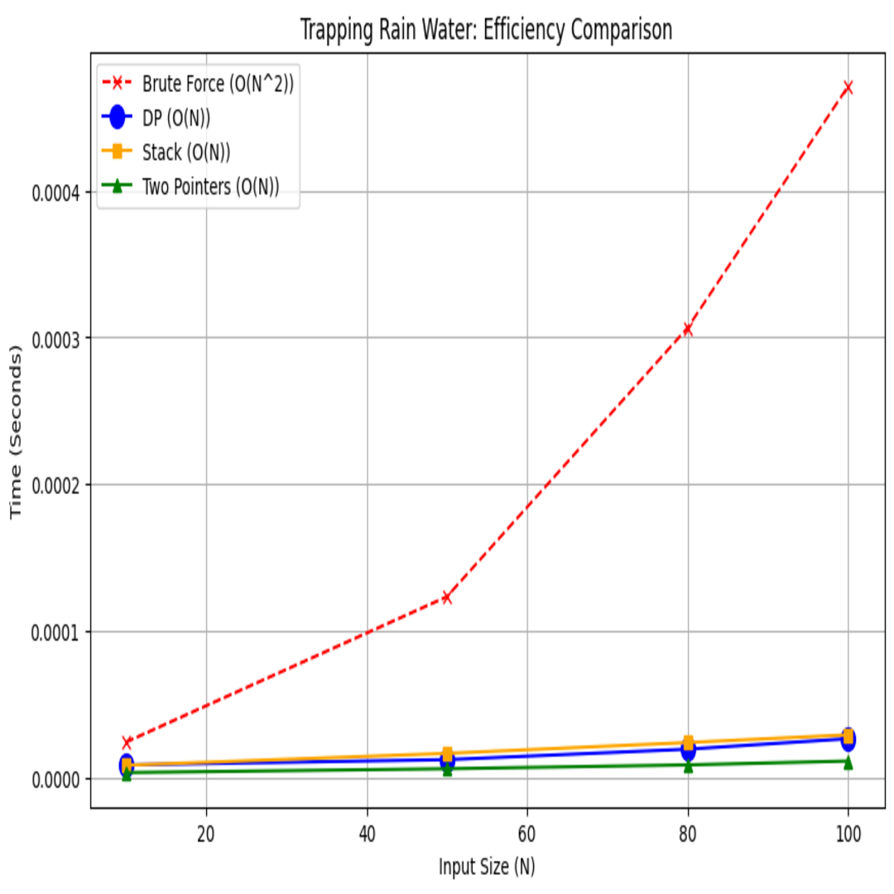
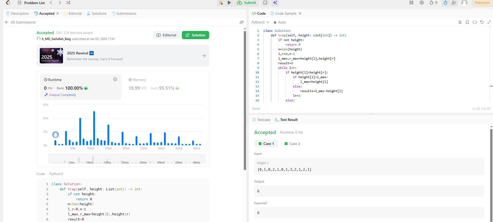

# 0042. Trapping Rain Water

| **Author** | **Last Updated** | **Difficulty** | **Tags** |
| :--- | :--- | :--- | :--- |
| MD Saifullah Baig.A | 05.01.2026 | 🔴 Hard | Array, Two Pointers, Dynamic Programming, Stack |

**Problem Link:** [LeetCode 0042](https://leetcode.com/problems/trapping-rain-water/)

---

## 📂 Quick Access
| Approach | Time Complexity | Space Complexity | Code Link |
| :--- | :--- | :--- | :--- |
| **1. Brute Force** | $O(N^2)$ | $O(1)$ | [📄 View Solution](./Brute_Force/Brute_Force.py) |
| **2. Dynamic Approach** | $O(N)$ | $O(N)$ | [📄 View Solution](./Dynamic_Approach/Dynamic_Approach.py) |
| **3. Stack Approach** | $O(N)$ | $O(N)$ | [📄 View Solution](./Stack_Approach/Stack_Approach.py) |
| **4. Converging Pointers** | $O(N)$ | $O(1)$ | [📄 View Solution](./Converging_Pointers(Best)/Converging_Pointers.py) |

---

## 1. Problem Statement

Given `n` non-negative integers representing an elevation map where the width of each bar is `1`, compute how much water it can trap after raining.

**Example 1:**
```text
Input: height = [0,1,0,2,1,0,1,3,2,1,2,1]
Output: 6
Explanation: The above elevation map (black section) is represented by array [0,1,0,2,1,0,1,3,2,1,2,1]. 
In this case, 6 units of rain water (blue section) are being trapped.
```

## 2. Approach Analysis
### 🐢 Approach 1: Brute Force (Naive)
The most intuitive method. For every single bar, we find the highest walls to its left and right to determine the water level.
+ Logic:
    1. Iterate through the array from index 0 to N-1.
    2. For each element i, scan left to find left_max.
    3. For each element i, scan right to find right_max.
    4. Water at i = min(left_max, right_max) - height[i].
+ Complexity:
 - Time: 2$O(N^2)$ — For each element, we scan the array again.
 - Space: 4$O(1)$ — Only constant extra variables used.
+ Verdict: ❌ Time Limit Exceeded (TLE). Too slow for large inputs (6$N > 10,000$).
### ⚖️ Approach 2: Dynamic Programming (Pre-computation)
We optimize the Brute Force method by trading space for time. Instead of scanning repeatedly, we pre-compute the maximums.
+ Logic:
    1. Create an array max_left and fill it: max_left[i] = max(height[i], max_left[i-1]).
    2. Create an array max_right and fill it backwards: max_right[i] = max(height[i], max_right[i+1]).
    3. Iterate once to calculate water: min(max_left[i], max_right[i]) - height[i].
+ Complexity:
    - Time: $O(N)$ — We traverse the array three times (linear).
    - Space: $O(N)$ — Uses two extra arrays of size N.
+ Verdict: ✅ Fast but Heavy. Good time complexity, but uses extra memory.
### 🥞 Approach 3: Monotonic Stack
We process the "valleys" horizontally. We use a stack to keep track of decreasing heights.
+ Logic:
    - Iterate through the array.
    - While the stack is not empty and height[i] > stack.top():Pop the top (this is the bottom of the container).- Found a left wall at the new stack top and a right wall at i.
    - Calculate water volume: distance * bounded_height.
    - Push i to stack.
+ Complexity:
    - Time: $O(N)$ — Each element is pushed and popped exactly once.
    - Space: $O(N)$ — Stack size grows linearly in worst case.
+ Verdict: 
✅ Efficient. Useful for variations of this problem, but slightly harder to implement.
### 🚀 Approach 4: Two Pointers (Optimal)
The standard optimal solution. We eliminate the need for extra arrays by computing max heights on the fly.
+ Logic:
    - Initialize pointers left and right at the ends.Maintain left_max and right_max.
    - Greedy Decision: The water level is always limited by the shorter side.
    - If height[left] < height[right]: Process the left side. Update left_max, add water, move left inward.
    - Else: Process the right side. Update right_max, add water, move right inward.
+ Complexity:
    - Time: $O(N)$ — Single pass.
    - Space: $O(1)$ — No extra arrays or stacks.
+ Verdict: ✅ Best Solution. Optimal Time and Space.
### 3. 📊 Efficiency Graph
The graph below compares the quadratic growth of Brute Force vs the linear efficiency of DP and Two Pointers.

### 4. LeetCode Submission Results
📂 Project Structure

``` text 
├── Array_and_Hashmap/
│   └── Two_Pointers/
|           |0042_Trapping_Rain_Water/
│           ├── assets/
│           │   ├── efficiency_graph.png              # Visualization of Time Complexity
│           │   └── Submission_Results.png            # Acceptance Rank
│           │
│           ├── Brute_Force/
│           │   └── Brute_Force.py                    # Naive Approach (O(N^2))
│           │   └── Brute_Force.ipynb                 # Reference Jupyter Notebook
│           │
│           ├── Dynamic_Programming/
│           │   └── Dynamic_Programming.py            # Pre-computation (O(N) Time, O(N) Space)
│           │   └── Dynamic_Programming.ipynb         # Reference Jupyter Notebook
│           │
│           ├── Monotonic_Stack/
│           │   └── Monotonic_Stack.py                # Stack Approach (O(N) Time, O(N) Space)
│           │   └── Monotonic_Stack.ipynb             # Reference Jupyter Notebook
│           │
│           ├── Two_Pointers(Best)/
│           │   └── Two_Pointers.py                   # Optimal Approach (O(N) Time, O(1) Space)
│           │   └── Two_Pointers.ipynb                # Reference Jupyter Notebook
│           │
│           └── README.md                             # Problem Documentation & Analysis
```