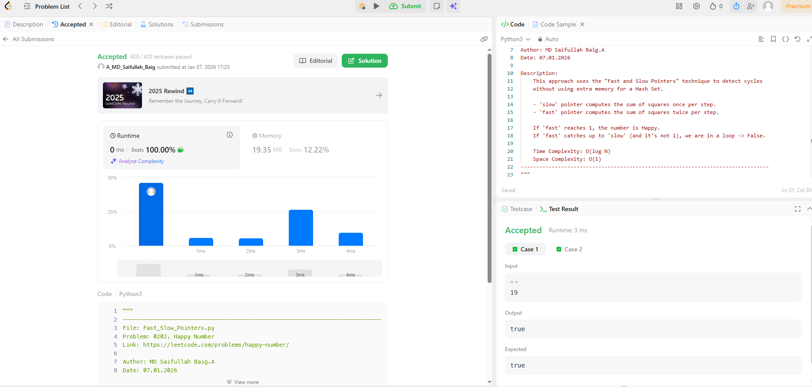

# 0202. Happy Number

| **Author** | **Last Updated** | **Difficulty** | **Tags** |
| :--- | :--- | :--- | :--- |
| MD Saifullah Baig.A | 07.01.2026 | 🟢 Easy | Hash Table, Math, Two Pointers |

**Problem Link:** [LeetCode 0202](https://leetcode.com/problems/happy-number/)

---

## 📂 Quick Access
| Approach | Time Complexity | Space Complexity | Code Link |
| :--- | :--- | :--- | :--- |
| **1. Hash Set** | $O(\log N)$ | $O(\log N)$ | [📄 View Solution](./Hash_Set/Hash_Set.py) |
| **2. Fast & Slow Pointers** | $O(\log N)$ | $O(1)$ | [📄 View Solution](./Fast_Slow_Pointers/Fast_Slow_Pointers.py) |
| **3. Math (Rule 4)**| $O(\log N)$ | $O(1)$ | [📄 View Solution](Math_Optimization/Math_Optimization.py) |

---

## 1. Problem Statement

Write an algorithm to determine if a number `n` is happy.

A **happy number** is a number defined by the following process:
1. Starting with any positive integer, replace the number by the sum of the squares of its digits.
2. Repeat the process until the number equals 1 (where it will stay), or it loops endlessly in a cycle which does not include 1.
3. Those numbers for which this process ends in 1 are happy.

Return `true` if `n` is a happy number, and `false` if not.

**Example 1:**
```text
Input: n = 19
Output: true
Explanation:
1^2 + 9^2 = 82
8^2 + 2^2 = 68
6^2 + 8^2 = 100
1^2 + 0^2 + 0^2 = 1
```
---
## 2. Approach Analysis
### 🐢 Approach 1: Hash Set Detection
The intuitive "Simulation" approach.

+ Logic: 
    + We compute the chain of numbers.
    + To detect infinite loops, we store every number we see in a Set.
    + If we encounter a number that is already in the Set, we know we are stuck in a cycle.

+ Complexity:

    + Time: O(logN) — Processing digits.

    + Space: O(logN) — The set grows as the chain gets longer.

+ Verdict: ✅ Good for Scripting. Easiest to write and understand, but uses unnecessary memory.

### 🚀 Approach 2: Fast & Slow Pointers (Floyd's Cycle Finding)
The "Interview Standard" approach used for Linked Lists.
+ Logic:
    -We treat the number sequence like a Linked List.

    - slow pointer calculates the next number once.

    - fast pointer calculates the next number twice.

    - If fast reaches 1, it is Happy.

    - If fast catches up to slow, there is a Cycle (Unhappy).

+ Complexity:

    + Time: O(logN) — Slightly slower constant factor due to repeated math.

    + Space: O(1) — No extra data structures needed.

+ Verdict: 🏆 Optimal for Interviews. Demonstrates strong algorithmic knowledge (Floyd's Algorithm).

### 🧠 Approach 3: Math (Cycle 4)
The "Engineering Optimization" based on mathematical properties.

+ Logic: It is a known mathematical fact that all non-happy numbers eventually fall into the cycle:

    4→16→37→58→89→145→42→20→4
    - We simply simulate the process and check: "Did we hit 1? Or did we hit 4?"

+ Complexity:

    + Time: O(logN) — Fastest runtime in practice.

    + Space: O(1) — Zero overhead.

+ Verdict: ⚡ Best for Production. It is the most efficient but requires knowing the "Rule of 4" trick.

### 3. 📊 Efficiency Comparison
The graph below visualizes the trade-off.

Green Line (Math Rule 4): Fastest time, lowest memory.

Orange Line (Pointers): Lowest memory, but slightly slower time.

Blue Line (Hash Set): Fast time, but high memory usage.


### 4. Submission Results:


### 5. 📂 Project Structure

```text
DSA/
├── Math_and_Geometry/
│   └── 0202_Happy_Number/
│       ├── assets/
│       │   └── Effciency_Graph.png
|       │   └── Submission_Results.png
│       │
│       ├── Hash_Set/
│       │   └── Hash_Set.py            # Naive Approach (Set)
│       │
│       ├── Fast_Slow_Pointers/
│       │   └── Fast_Slow_Pointers.py  # Interview Approach (O(1) Space)
│       │
│       ├── Math_Cycle_4/
│       │   └── Math_Approach.py       # Optimized Approach (Hardcoded)
│       |
│       └── README.md                  # Documentation
```