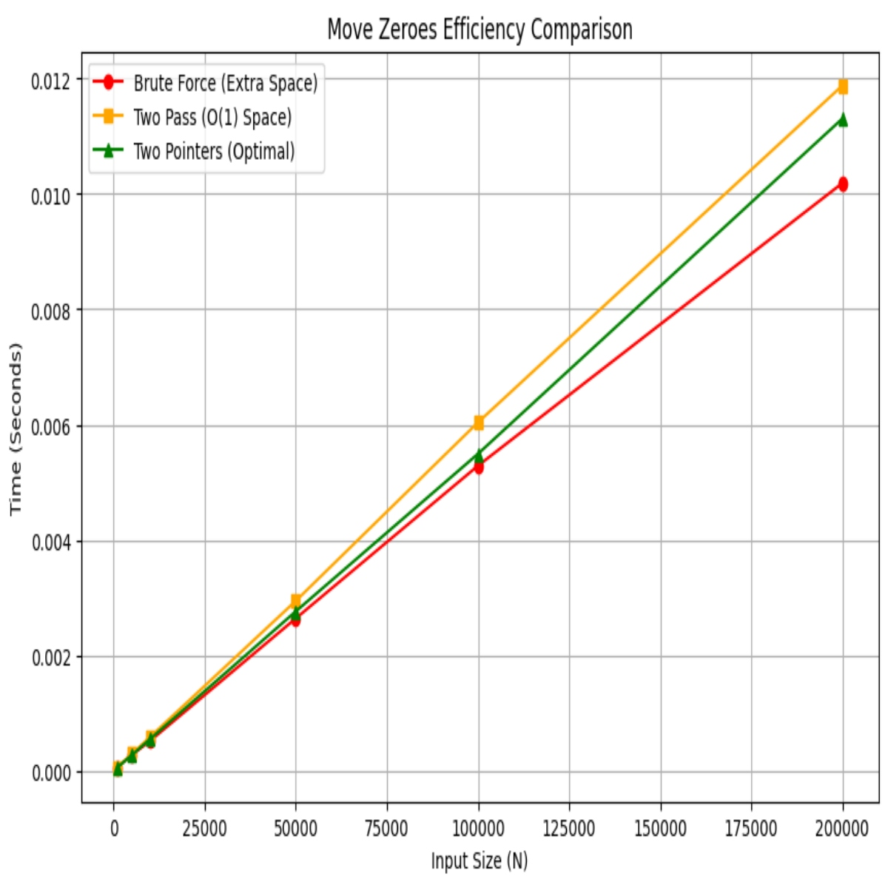
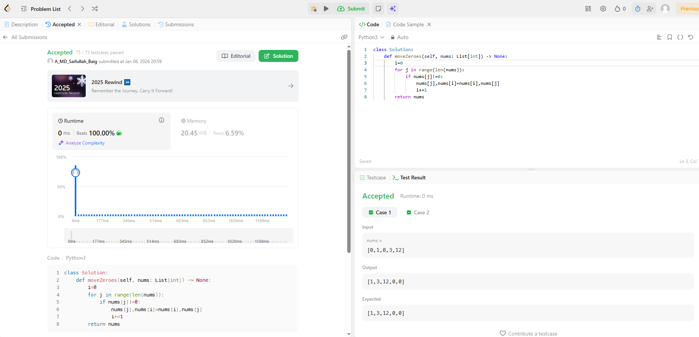

# 0283. Move Zeroes

| **Author** | **Last Updated** | **Difficulty** | **Tags** |
| :--- | :--- | :--- | :--- |
| MD Saifullah Baig.A | 06.01.2026 | 🟢 Easy | Array, Two Pointers |

**Problem Link:** [LeetCode 0283](https://leetcode.com/problems/move-zeroes/)

---

## 📂 Quick Access
| Approach | Time Complexity | Space Complexity | Code Link |
| :--- | :--- | :--- | :--- |
| **1. Brute Force** | $O(N)$ | $O(N)$ | [📄 View Solution](./Brute_Force/Brute_Force.py) |
| **2. Two Pass** | $O(N)$ | $O(1)$ | [📄 View Solution](./Two_Pass/Two_Pass.py) |
| **3. Two Pointers (Best)**| $O(N)$ | $O(1)$ | [📄 View Solution](./Fast_and_Slow_Pointers(Best)/Fast_and_Slow_Pointers.py) |

---

## 1. Problem Statement

Given an integer array `nums`, move all `0`'s to the end of it while maintaining the relative order of the non-zero elements.

**Note** that you must do this in-place without making a copy of the array.

**Example 1:**
```text
Input: nums = [0,1,0,3,12]
Output: [1,3,12,0,0]
```

## 2. Approach Analysis
+ 🐢 Approach 1: Brute Force (Extra Space)
The most intuitive method using a temporary list.

+ Logic:

    - Create a temporary list temp.

    - Iterate through nums and append all non-zero elements to temp.

    - Copy elements from temp back into nums.

    - Fill the remaining positions in nums with 0.

+ Complexity:

    1. Time: O(N) — We iterate through the array.

    2. Space: O(N) — We use extra space for the temporary list.

+ Verdict: ⚠️ Not Optimal. Violates the "in-place" requirement, but good for understanding logic.

### 🚶 Approach 2: Two Pass (Overwrite & Fill)
An in-place solution that uses two separate loops.

+ Logic:

    - Pass 1: Iterate through the array with a pointer idx. If an element is non-zero, overwrite nums[idx] with it and increment idx.

    - Pass 2: Start from idx and fill the rest of the array with 0s.

+ Complexity:

    1. Time: O(N) — We traverse the array twice (once to move, once to fill).

    2. Space: O(1) — No extra data structures used.

+ Verdict: ✅ Acceptable. Meets space constraints but performs more write operations than necessary.

### 🚀 Approach 3: Two Pointers (Swap - Optimal)
The industry standard "Partitioning" solution. We use a "Slow" and "Fast" pointer to swap elements in a single pass.

+ Logic:

    - Initialize l (left/slow) at 0. This tracks where the next non-zero should go.

    - Iterate r (right/fast) through the array.

    - If nums[r] != 0:

    - Swap nums[l] and nums[r].

    - Increment l.

    - Zeros naturally "bubble" to the end as we swap non-zeros forward.

+ Complexity:

1. Time: O(N) — Single pass traversal.

2. Space: O(1) — Constant extra space.

### Verdict: 🏆 Optimal. Minimizes code and operations (one pass).

## 3. 📊 Efficiency Graph
The graph below compares the runtime. Notice how Two Pointers (Green) is slightly faster than Two Pass (Orange) because it avoids the second loop.



## 4. LeetCode Submission Results
📂 Project Structure

```text
DSA/
├── Array_and_Hashmap/
│   └── Two_Pointers/
|           |0283_Move_Zeroes/
│           ├── assets/
│           │   ├── efficiency_graph.png       # Visualization of Time Complexity
│           │   └── Submission_Results.png     # Acceptance Rank
│           │
│           ├── Brute_Force/
│           │   └── Brute_Force.py             # Naive Approach (O(N) Space)
│           │   └── Brute_Force.ipynb          #Reference Notebook
│           │
│           ├── Two_Pass/
│           │   └── Two_Pass.py                # In-Place (2 Loops)
│           │   └── Brute_Force.ipynb          #Reference Notebook
│           │
│           ├── Two_Pointers(Best)/
│           │   └── Two_Pointers.py            # Optimal Swap (1 Loop)
│           │   └── Brute_Force.ipynb          #Reference Notebook
│           │
│           └── README.md                      # Problem Documentation & Analysis
```