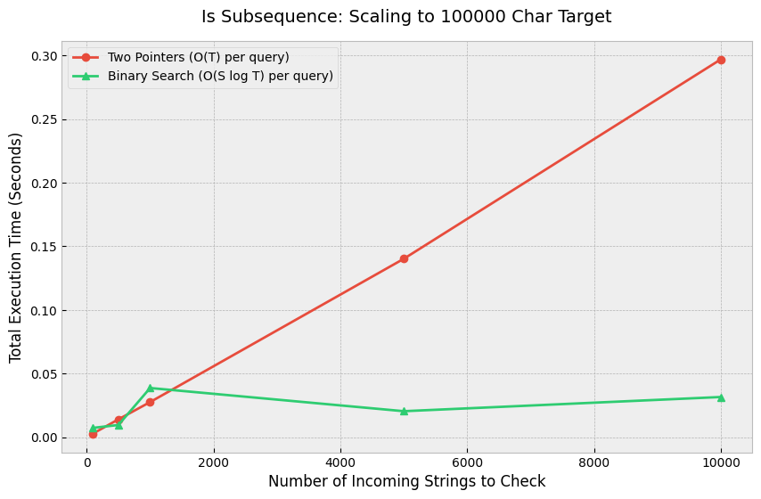
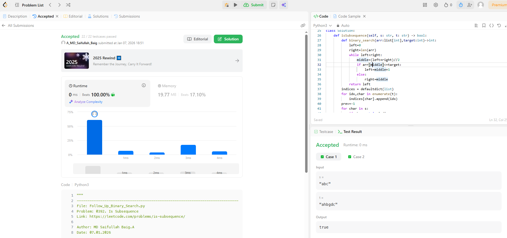
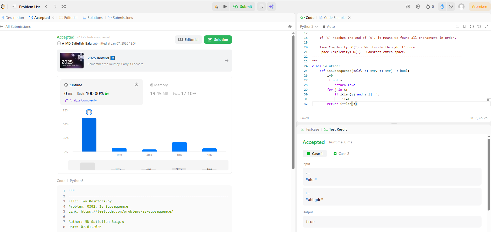

# 0392. Is Subsequence

| **Author** | **Last Updated** | **Difficulty** | **Tags** |
| :--- | :--- | :--- | :--- |
| MD Saifullah Baig.A | 07.01.2026 | 🟢 Easy | Two Pointers, String, Binary Search |

**Problem Link:** [LeetCode 0392](https://leetcode.com/problems/is-subsequence/)

---

## 📂 Quick Access
| Approach | Time Complexity | Space Complexity | Code Link |
| :--- | :--- | :--- | :--- |
| **1. Two Pointers** | $O(T)$ | $O(1)$ | [📄 View Solution](./Two_Pointers/Two_Pointers.py) |
| **2. Binary Search** | $O(S \cdot \log T)$ | $O(T)$ | [📄 View Solution](./Binary_Search/Binary_Search.py) |

> **Note:** $T$ is the length of the target string `t`, and $S$ is the length of the source string `s`.

---

## 1. Problem Statement

Given two strings `s` and `t`, return `true` if `s` is a **subsequence** of `t`, or `false` otherwise.

A **subsequence** of a string is a new string that is formed from the original string by deleting some (can be none) of the characters without disturbing the relative positions of the remaining characters.
(i.e., `"ace"` is a subsequence of `"abcde"` while `"aec"` is not).

**Example 1:**
```text
Input: s = "abc", t = "ahbgdc"
Output: true
```
---
## 2. Approach Analysis
### 🚀 Approach 1: Two Pointers (Standard Optimal)
This is the standard greedy approach used when you only need to check one string s.

+ Logic: 
    +Use pointer i for s and pointer j for t.

    + If s[i] == t[j], we found a match! Move both pointers.

    + If s[i] != t[j], we only move j (skip this character in t).

    + If i reaches the end of s, we found everything.

+ Complexity:

    - Time: O(T) — We iterate through the main string t once.

    - Space: O(1) — Only two integer variables used.

+ Verdict: 🏆 Best for Single Checks. Simple, fast, and memory efficient.

### ⚡ Approach 2: Binary Search (Follow-Up)
Scenario: "Suppose there are 1 Billion incoming s strings, and you want to check one by one to see if they are subsequences of the same t."

+ The Problem: Scanning t (length N) a billion times is too slow (10^9×N).

+ The Solution: We preprocess t into an Index Map.

t = "babg" -> {'b': [0, 2], 'a': [1], 'g': [3]}

We then use Binary Search (Upper Bound) to find the next valid character index without scanning.

+ Complexity:

    + Time: O(S⋅logT) per query.

    + Space: O(T) — To store the index map.

+ Verdict: 🏭 Best for High Volume Streams. The initial setup cost is heavy, but each subsequent check is lightning fast.

## 3. 📊 Efficiency Comparison
The graph below visualizes the performance difference between the approaches.



---

## 4. 🏆 LeetCode Submission
Here is the proof of the optimal solution's runtime and memory usage.


<br>

### 5. 📂 Project Structure
```TEXT
DSA/
├── Two_Pointers/
│   └── 0392_Is_Subsequence/
│       ├── Two_Pointers/
│       │   └── Two_Pointers.py        # Standard Greedy Approach
│       │
│       ├── Binary_Search_FollowUp/
│       │   └── Follow_Up_Binary_Search.py  # Optimized for Stream (Index Map)
│       │
|       ├── assets/
│       ├── Efficiency_Graph.png   
│       |── Binary_Search_Results.png  
|       |──Pointers_Results.png
|       |
│       └── README.md                  # Documentation