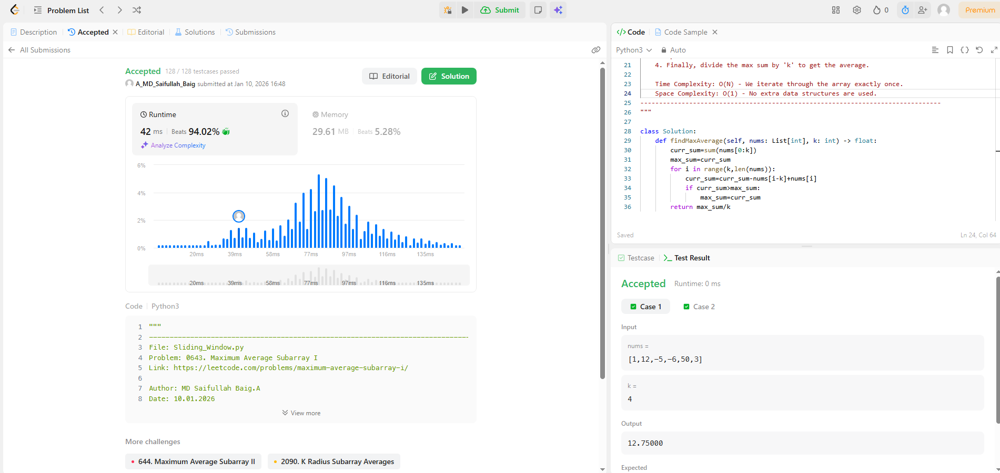

# 0643. Maximum Average Subarray I

| **Author** | **Last Updated** | **Difficulty** | **Tags** |
| :--- | :--- | :--- | :--- |
| MD Saifullah Baig.A | 10.01.2026 | 🟢 Easy | Array, Sliding Window, Prefix Sum |

**Problem Link:** [LeetCode 0643](https://leetcode.com/problems/maximum-average-subarray-i/)

---

## 📂 Quick Access
| Approach | Time Complexity | Space Complexity | Code Link |
| :--- | :--- | :--- | :--- |
| **1. Brute Force** | $O(N \cdot k)$ | $O(1)$ | [📄 View Solution](./Brute_Force.py) |
| **2. Prefix Sum** | $O(N)$ | $O(N)$ | [📄 View Solution](./Prefix_Sum.py) |
| **3. Sliding Window** | $O(N)$ | $O(1)$ | [📄 View Solution](./Sliding_Window.py) |

> **Recommended:** Approach 3 (Sliding Window) is the most efficient as it avoids extra memory allocation.

---

## 1. Problem Statement

You are given an integer array `nums` consisting of `n` elements, and an integer `k`.

Find a contiguous subarray whose **length is equal to `k`** that has the maximum average value and return this value.

**Example 1:**
```text
Input: nums = [1,12,-5,-6,50,3], k = 4
Output: 12.75000
Explanation: Maximum average is (12 - 5 - 6 + 50) / 4 = 51 / 4 = 12.75
```

## 📊 Complexity Analysis

| Approach | Time Complexity | Space Complexity | Key Idea |
| :--- | :--- | :--- | :--- |
| **Brute Force** | $O(N \cdot k)$ | $O(1)$ | Re-calculates the sum for every window from scratch. |
| **Prefix Sum** | $O(N)$ | $O(N)$ | Uses an extra array to store cumulative sums for $O(1)$ range queries. |
| **Sliding Window** | $O(N)$ | $O(1)$ | **Optimal.** Updates the sum incrementally (add new, remove old). |

## 2. Approach Analysis
### 🐢 Approach 1: Brute Force (Time Limit Exceeded)
This approach checks every possible window of size k and sums its elements from scratch using a nested loop.
+ Why it fails: For large inputs ($N=100,000$, $k=50,000$), the operations explode to $5 \times 10^9$.
+ Status: Correct logic, but too slow for production.
### 💾 Approach 2: Prefix Sum (Cumulative Sum)
We trade space for speed by pre-calculating a cumulative sum array.
+ Formula: $Sum(i, k) = Prefix[i] - Prefix[i-k]$
+ Pros: Allows $O(1)$ query time for any range sum.
+ Cons: Requires $O(N)$ extra memory to store the prefix array.
### 🚀 Approach 3: Sliding Window (Optimal)
+ This technique "slides" a fixed-size window across the array. 
+ Instead of recalculating the sum, we update it incrementally:Subtract the element leaving the window.
+ Add the element entering the window.

<br>

+ Core Logic:
    + Pythoncurrent_sum += nums[i] - nums[i - k]
    + max_sum = max(max_sum, current_sum)
+ Pros: $O(N)$ speed with $O(1)$ memory.

## 3. 📂 Project Structure
```text
DSA/
├── Arrays/
│   └── 0643_Maximum_Average_Subarray_I/
│       |
│       │Brute_Force.py             # O(N*k) Solution
│       │
│       │Prefix_Sum.py              # O(N) Space Solution
│       │
│       │Sliding_Window.py          # O(N) Time, O(1) Space (Optimal)
│       │
│       ├── assets/
│       │   ├── Efficiency_graph.png
│       │   └── Submission_Results.png
│       │
│       └── README.md
```
## 4. 📊 Efficiency Comparison


---

## 5. 🏆 LeetCode Submission
