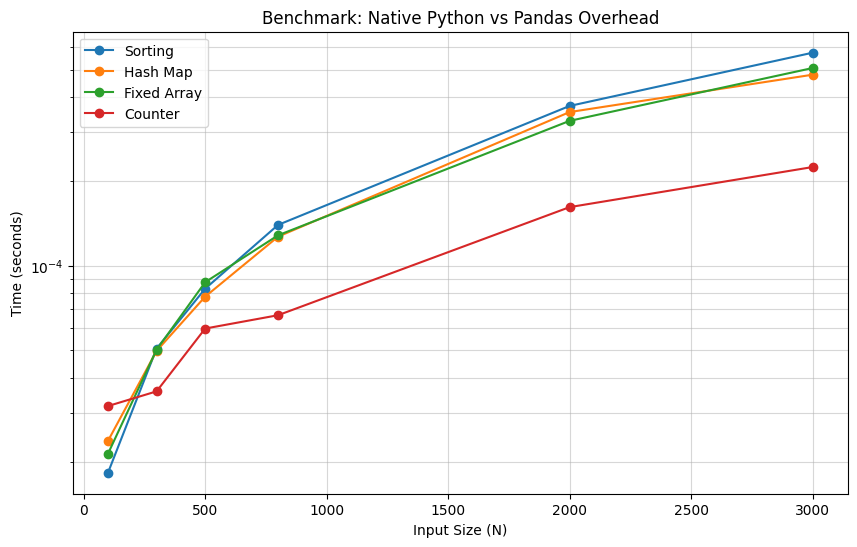
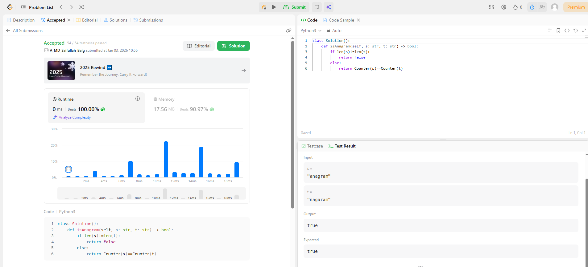

# 0242. Valid Anagram

| **Author** | **Last Updated** | **Difficulty** | **Tags** |
| :--- | :--- | :--- | :--- |
| MD Saifullah Baig.A | 03.01.2026 | 🟢 Easy | String, Hash Table, Sorting |

**Problem Link:** [LeetCode 0242](https://leetcode.com/problems/valid-anagram/)

---

## 📂 Quick Access
| Approach | Time Complexity | Space Complexity | Code Link |
| :--- | :--- | :--- | :--- |
| **1. Sorting (Brute Force)** | $O(N \log N)$ | $O(N)$ | [📄 View Solution](./Brute_Force/Brute_Force.py) |
| **2. Hash Map** | $O(N)$ | $O(1)$ | [📄 View Solution](./Hash_Map(Best)/Hash_Map.py) |
| **3. Fixed Size Array** | $O(N)$ | $O(1)$ | [📄 View Solution](./Fixed_Size_Array/Fixed_Size_Array.py) |
| **4. Pythonic Counter**| $O(N)$ | $O(1)$ | [📄 View Solution](./Frequency_Counter(Pythonic_Best)/Frequency_Counter.py) |

---

## 1. Problem Statement

Given two strings `s` and `t`, return `true` if `t` is an **anagram** of `s`, and `false` otherwise.

An **Anagram** is a word or phrase formed by rearranging the letters of a different word or phrase, typically using all the original letters exactly once.

**Example 1:**
```text
Input: s = "anagram", t = "nagaram"
Output: true
```
## 2. Approach Analysis
### 🐢 Approach 1: Sorting (Brute Force)
The most intuitive logic: "If they are anagrams, they must look identical when sorted."

* Logic:

    1. Check if len(s) != len(t). If so, return False.

    2. Sort string s alphabetically.

    3. Sort string t alphabetically.

    4. Compare the two sorted lists. If equal, return True.

* Complexity:

    * Time: O(NlogN) — Dominated by the sorting algorithm (Timsort).

    * Space: O(N) — Python's sorted() creates a new list of characters.

* Verdict: ⚠️ Acceptable, but inefficient compared to linear time solutions. Good for saving lines of code, bad for performance on large strings.

### ⚖️ Approach 2: Hash Map (Frequency Counter)
The standard interview solution. We count character frequencies manually.

* Logic:

    1. Create an empty dictionary count.

    2. Iterate through s, incrementing counts for each character.

    3. Iterate through t, decrementing counts.

    4. If a character in t doesn't exist in count or its count drops below zero, return False.

    5. Return True if all checks pass.

* Complexity:

    * Time: O(N) — We traverse the strings exactly once.

    * Space: O(1) — The map size is limited by the alphabet size (26 letters or ~149k Unicode chars), which is constant relative to N.

* Verdict: ✅ Optimal. Handles Unicode characters (emojis, etc.) correctly and is O(N).

### 🚀 Approach 3: Fixed Size Array (Optimized)
Optimization of Approach 2 for scenarios restricted to lowercase English letters (a-z).

* Logic:

    1. Initialize an integer array counts of size 26 (indices 0-25).

    2. Iterate through both strings simultaneously.

    3. For s[i], increment index ord(s[i]) - 97.

    4. For t[i], decrement index ord(t[i]) - 97.

    5. Scan the array; if any value is non-zero, return False.

* Complexity:

    * Time: O(N) — Single pass + constant time array scan.

    * Space: O(1) — Strictly uses 26 integers.

* Verdict: ✅ Fastest. Slightly faster than Hash Map in practice due to memory locality and no hashing overhead.

### 🐍 Approach 4: Pythonic Counter
A concise one-liner using Python's standard library.

- Logic:

    1. Import Counter from collections.

    2. Create frequency maps for both strings: Counter(s) and Counter(t).

    3. Compare them directly using ==.

- Complexity:

    - Time: O(N) — Constructing a Counter takes linear time.

    - Space: O(1) — Same as Hash Map.

- Verdict: ✅ Optimal & Concise. Best for production code, but interviewers may ask for the manual implementation (Approach 2 or 3) first.

## 3. 📊 Efficiency Graph

The graph below compares the runtime. Notice how Sorting (Red) scales poorly compared to the linear time approaches (Green/Blue).


<br>

## 4. LeetCode Submission Results


<br>
📂 Project Structure

```text
DSA/
├── Array_and_Hashmap/
│   └── Hashing/
|           |0242_Valid_Anagram/
│           ├── assets/
│           │   ├── efficiency_graph.png                          # Visualization of Time Complexity
│           │   └── Submission_Results.png                        # Acceptance Rank
│           │
│           ├── Sorting_Brute_Force/
│           │   └── Sorting_Brute_Force.py                        # Naive Approach (O(N log N))
│           │   └── Sorting_Brute_Force.ipynb                     # Reference Jupyter Notebook
│           │
│           ├── Hash_Map/
│           │   └── Hash_Map.py                                   # Standard Approach (O(N))
│           │   └── Hash_Map.ipynb                                # Reference Jupyter Notebook
│           │
│           ├── Fixed_Size_Array/
│           │   └── Fixed_Size_Array.py                           # Optimized Approach (O(N))
│           │   └── Fixed_Size_Array.ipynb                        # Reference Jupyter Notebook
│           │
│           ├── Pythonic_Counter/
│           │   └── Pythonic_Counter.py                           # Concise Approach (O(N))
│           │   └── Pythonic_Counter.ipynb                        # Reference Jupyter Notebook
│           │
│           └── README.md                                         # Problem Documentation & Analysis
```