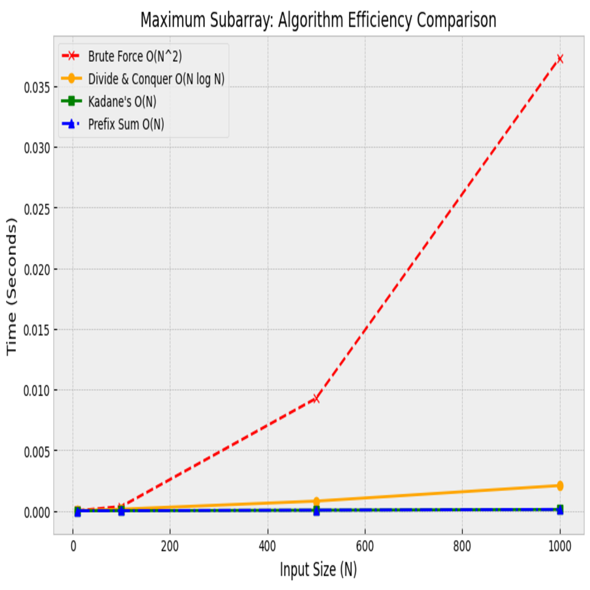
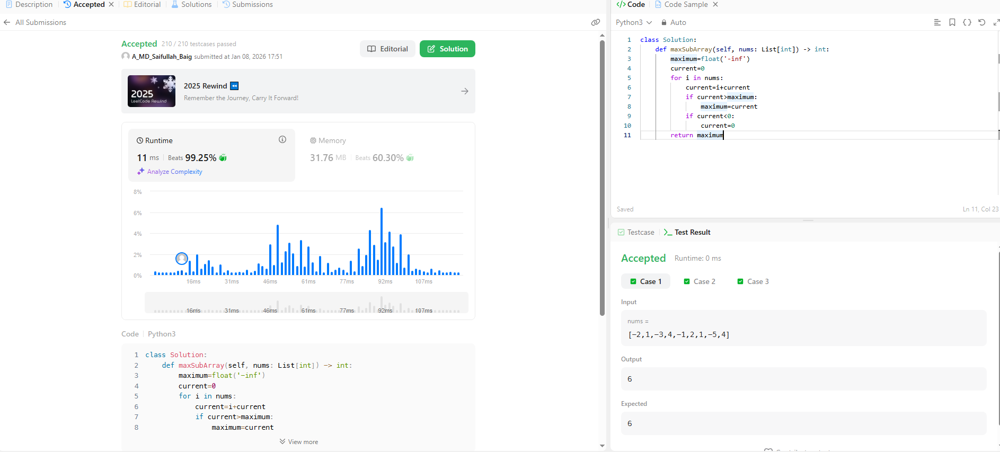

# 0053. Maximum Subarray

| **Author** | **Last Updated** | **Difficulty** | **Tags** |
| :--- | :--- | :--- | :--- |
| MD Saifullah Baig.A | 08.01.2026 | 🟡 Medium | Array, Dynamic Programming, Divide and Conquer |

**Problem Link:** [LeetCode 0053](https://leetcode.com/problems/maximum-subarray/)

---

## 📂 Quick Access
| Approach | Time Complexity | Space Complexity | Code Link |
| :--- | :--- | :--- | :--- |
| **1. Brute Force** | $O(N^2)$ | $O(1)$ | [📄 View Solution](./Brute_Force.py) |
| **2. Divide & Conquer** | $O(N \log N)$ | $O(\log N)$ | [📄 View Solution](./Divide_and_Conquer) |
| **3. Kadane's Algo** | $O(N)$ | $O(1)$ | [📄 View Solution](./Kadane's_Approach(Best)) |
| **4. Prefix Sum** | $O(N)$ | $O(1)$ | [📄 View Solution](./Prefix_Sum.py) |

<br>

> **Recommended:** Approach 3 (Kadane's Algorithm) is the industry standard for this problem.

---

## 1. Problem Statement

Given an integer array `nums`, find the contiguous subarray (containing at least one number) which has the largest sum and return *its sum*.

**Example 1:**
```text
Input: nums = [-2, 1, -3, 4, -1, 2, 1, -5, 4]
Output: 6
Explanation: [4, -1, 2, 1] has the largest sum = 6.
```
---
## 2. Approach Analysis
## 📊 Complexity Analysis

| Approach | Time Complexity | Space Complexity | key Idea |
| :--- | :--- | :--- | :--- |
| **Brute Force** | $O(N^2)$ | $O(1)$ | Check every possible subarray pair $(i, j)$. |
| **Divide & Conquer** | $O(N \log N)$ | $O(\log N)$ | Recursive split; merge Left, Right, and Crossing sums. |
| **Kadane's Algo** | $O(N)$ | $O(1)$ | **Optimal.** Greedy decision to reset negative sums. |
| **Prefix Sum** | $O(N)$ | $O(1)$ | Mathematical optimization tracking `Min_Prefix_Sum`. |
### 🐢 Approach 1: Brute Force (Time Limit Exceeded)
This approach checks every possible subarray.

+ Logic: 
    + Use nested loops. 
    + The outer loop i picks the start, the inner loop j picks the end. 
    + Calculate sum for nums[i...j].

+ Why it fails: With N=100,000, N^2 operations is roughly 10 Billion steps. This exceeds the 1-second time limit.

### ⚔️ Approach 2: Divide and Conquer (Merge Sort Style)
This breaks the array into two halves, recursively finding the max sum in the Left, Right, and Crossing the middle.

+ Why use it? It is slower than Kadane's for a single CPU, but this logic is essential for Parallel Computing (MapReduce) or Segment Trees (Range Queries).
### 🚀 Approach 3: Kadane's Algorithm (Dynamic Programming)
This is the standard optimal solution. It iterates through the array once, deciding at each step whether to **extend** the current subarray or **start a new one**.

**Core Logic:**
$$CurrentSum = \max(Num, CurrentSum + Num)$$

We explored two implementation styles:
* **Straight Forward:** Explicitly resets the sum to `0` if it drops below zero. Great for visualizing the "snowball" effect.
* **Broad Minded:** Uses the `max()` function to implicitly handle resets. More concise and Pythonic.

---

### 📉 Approach 4: Prefix Sum Method
This approach uses the mathematical property of prefix sums:
$$Sum(i, j) = Prefix[j] - Prefix[i-1]$$

To find the maximum subarray ending at index `j`, we simply subtract the **minimum prefix sum** encountered so far from the current prefix sum.

**Logic:**
1.  Calculate running `Current_Prefix_Sum`.
2.  Track `Min_Prefix_Sum` seen previously.
3.  Max Subarray = $\max(GlobalMax, Current\_Prefix\_Sum - Min\_Prefix\_Sum)$.

### 3. 📂 Project Structure
``` text
DSA/
├── Arrays/
│   └── 0053_Maximum_Subarray/
│       |
│       │───Brute_Force.py             # O(N^2) Solution
│       │
│       |
│       │───Divide_And_Conquer.py      # O(N log N) Recursive Solution
│       │
│       │───Kadanes_Algorithm.py       # O(N) Optimal Solution
│       │
│       ├── assets/
│       │   ├── efficiency_graph.png
│       │   └── submission_screenshot.png
│       │
│       └── README.md
```

### 4. 📊 Efficiency Comparison
The graph below compares the runtime of all three approaches. Notice how Kadane's (Green) stays flat while Brute Force (Red) explodes.



### 5. 🏆 LeetCode Submission
Proof of the optimal solution passing 100% of test cases.

