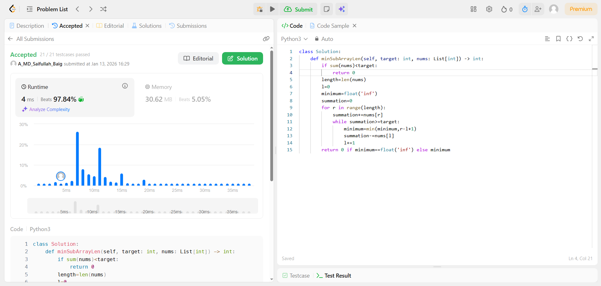

# 209. Minimum Size Subarray Sum

| **Author** | **Last Updated** | **Difficulty** | **Tags** |
| :--- | :--- | :--- | :--- |
| MD Saifullah Baig.A | 13.01.2026 | 🟡 Medium | Sliding Window, Array, Binary Search |

**Problem Link:** [LeetCode 209](https://leetcode.com/problems/minimum-size-subarray-sum/)

---

## 📂 Quick Access
| Approach | Time Complexity | Space Complexity | Code Link |
| :--- | :--- | :--- | :--- |
| **1. Binary Search** | $O(N \log N)$ | $O(N)$ | [📄 View Solution](./Prefix_Sum_Binary_Search.py) |
| **2. Sliding Window** | $O(N)$ | $O(1)$ | [📄 View Solution](./Sliding_Window(Best).py) |

<br>

> **Recommended:** Approach 2 (Sliding Window) is the optimal engineering solution. It runs in linear time and uses constant extra space.

---

## 1. Problem Statement

Given an array of positive integers `nums` and a positive integer `target`, return the **minimal length** of a subarray whose sum is greater than or equal to `target`. If there is no such subarray, return `0` instead.

**Example 1:**
```text
Input: target = 7, nums = [2, 3, 1, 2, 4, 3]
Output: 2
Explanation: The subarray [4, 3] has the minimal length under the problem constraint.
```
## 2. Approach Analysis

### 📊 Complexity Analysis
### 🐢 Approach 1: Binary Search (Prefix Sums)
This approach transforms the problem for cases where we cannot easily "shrink" a window (e.g., if negative numbers existed).

+ Logic:

    - Create a Prefix Sum array where prefix[i] is the sum of all numbers up to i.

    - Iterate through every starting index i.

    - For each i, use Binary Search to find the first ending index j such that prefix[j] - prefix[i] >= target.

    - Record the minimum distance j - i.

+ Why it works: Since nums contains positive integers, the prefix array is sorted, allowing for binary search logic.

+ Drawback: It is slower (O(NlogN)) and requires O(N) extra memory for the prefix array.

### 🚀 Approach 2: Sliding Window (Optimal)
This approach uses two pointers to scan the array exactly once, achieving O(1) space.

+ Core Logic:

    - Extend (Right Pointer): Add numbers to current_sum until it is ≥ target.

    - Retract (Left Pointer): Once the target is met, remove numbers from the left to minimize the length.

    - Repeat: Continue until the right pointer hits the end.

+ Efficiency: Each element is visited at most twice (added once, removed once), making it a strict O(N) solution.

## 3. 📂 Project Structure

```text
DSA/
├── Sliding_Window/
│   └── 209_Minimum_Size_Subarray_Sum/
│       |
│       │───Binary_Search.py             # O(N log N) Solution (Prefix Sums)
│       │
│       │───Sliding_Window.py            # O(N) Optimal Solution
│       │
│       │───generate_graph.py            # Benchmarking Script
│       │
│       ├── assets/
│       │   ├── Efficiency_graph_light.png
│       │   └── submission_success.png
│       │
│       └── README.md
```

### 4. 📊 Efficiency Comparison
The graph below compares the runtime performance. Note that the **Sliding Window (Green)** scales linearly ($O(N)$) and remains faster, while the **Binary Search (Blue)** grows steeper ($O(N \log N)$) as input size $N$ increases.


### 5. 🏆 LeetCode Submission
Proof of the optimal solution passing 100% of test cases.


