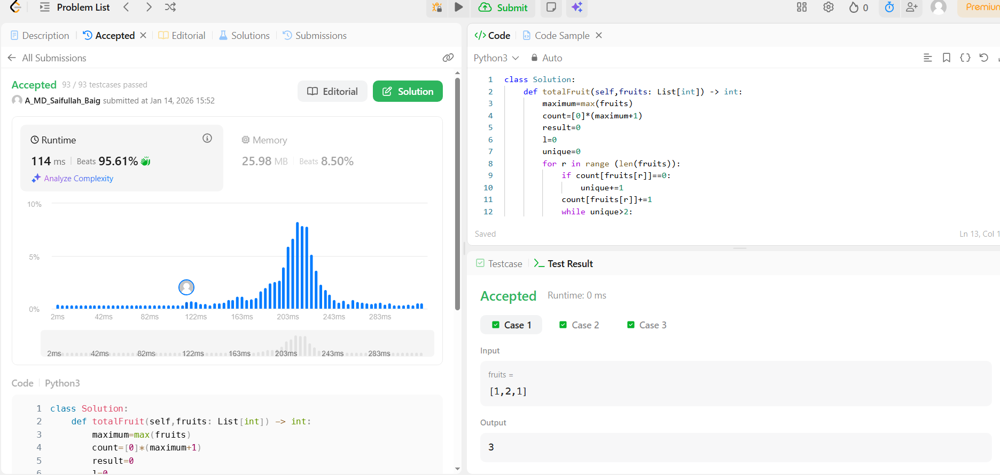

# 0904. Fruit Into Baskets

| **Author** | **Last Updated** | **Difficulty** | **Tags** |
| :--- | :--- | :--- | :--- |
| MD Saifullah Baig.A | 14.01.2026 | 🟡 Medium | Array, Hash Table, Sliding Window |

**Problem Link:** [LeetCode 0904](https://leetcode.com/problems/fruit-into-baskets/)

---

## 📂 Quick Access
| Approach | Time Complexity | Space Complexity | Code Link |
| :--- | :--- | :--- | :--- |
| **1. Brute Force** | $O(N^2)$ | $O(1)$ | [📄 View Solution](./Brute_Force/Brute_Force.py) |
| **2. Hash Map Window** | $O(N)$ | $O(1)$ | [📄 View Solution](./Sliding_Window_Map/Sliding_Window_Map.py) |
| **3. Fixed Array Window** | $O(N)$ | $O(M)$ | [📄 View Solution](./Sliding_Window_Array/Sliding_Window_Array.py) |

---

## 1. Problem Statement

You are visiting a farm that has a single row of fruit trees arranged from left to right. The trees are represented by an integer array `fruits` where `fruits[i]` is the **type** of fruit the `ith` tree produces.

You want to collect as much fruit as possible. However, the owner has some strict rules:
1.  You only have **two baskets**, and each basket can only hold a **single type** of fruit.
2.  Starting from any tree of your choice, you must pick exactly one fruit from **every** tree (including the start tree) while moving to the right.
3.  Once you reach a tree with fruit that cannot fit in your baskets, you must stop.

**Example 1:**
```text
Input: fruits = [1,2,1]
Output: 3
Explanation: We can pick from all 3 trees.
```
## 2. Approach Analysis
### 🐢 Approach 1: Brute Force (Naive)The most intuitive method. 
We treat every tree as a potential "starting point" and try to expand as far right as possible until we hit a 3rd fruit type.
+ Logic:
    - Loop i from 0 to N.Create a Set for the current basket.
    - Inner loop j from i to N. Add fruit to Set.
    - If Set.size > 2, break and record length.
+ Complexity:Time: O(N^2) — Nested loops check every subarray.
+ Space: O(1) — The set stores at most 3 integers.
+ Verdict: ❌ Time Limit Exceeded (TLE). Too slow for $N=100,000$.
## ⚖️ Approach 2: Sliding Window (Hash Map)The standard engineering solution.
 We use the "Caterpillar Method" to slide a window over the array, using a Dictionary to track fruit counts.
 + Logic:Expand (right): 
    - Add fruit to Map. Increment count.
    - Constraint: If len(Map) > 2, the window is invalid.
    - Shrink (left): Remove fruit from Map.
    - Decrement count.
    - Crucial: If count hits 0, del Map[key] to reduce size.
+ Complexity:
    - Time: $O(N)$ — Each fruit is added and removed at most once.
    - Space: $O(1)$ — Map stores at most 3 keys.
+ Verdict: ✅ Standard Solution. Safe for any range of numbers.
### 🚀 Approach 3: Sliding Window (Fixed Array)We optimize the data structure.
 Instead of a Hash Map (which has overhead), we use a direct access integer array.
 + Logic:
    - Pre-allocate an array count of size max(fruits) + 1.
    - Use the Fruit ID directly as the array index.Track distinct_types manually.
    - Same sliding window logic as Approach 2, but array access is instant.
+ Complexity:
    + Time: $O(N)$ — Faster constant factors than Hash Map.
    + Space: $O(M)$ — Where M is the maximum fruit ID.
+ Verdict: ⚡ Fastest Execution. Best for high-performance requirements.
### 3. 📊 Efficiency Graph
The graph below shows why the Brute Force approach fails (Red Line) and how the Array approach (Purple Line) is slightly faster than the Hash Map (Blue Line).


### 4. LeetCode Submission Results

## 📂 Project Structure
```text
├── Sliding_Window/
│   └── 0904_Fruit_Into_Baskets/
│       ├── assets/
│       │   ├── efficiency_graph.png              # O(N) vs O(N^2) Visualization
│       │   └── Submission_Results.png            # Acceptance Rank
│       │
│       ├── Brute_Force/
│       │   ├── Brute_Force.py                    # Naive Approach (O(N^2))
│       │   └── Brute_Force.ipynb                 # Reference Notebook
│       │
│       ├── Sliding_Window_Map/
│       │   ├── Sliding_Window_Map.py             # Standard Solution (O(N))
│       │   └── Sliding_Window_Map.ipynb          # Explained Solution
│       │
│       ├── Sliding_Window_Array/
│       │   ├── Sliding_Window_Array.py           # Optimized Solution (O(N) Fast)
│       │   └── Sliding_Window_Array.ipynb        # Performance Tuning
│       │
│       └── README.md                             # Documentation
```